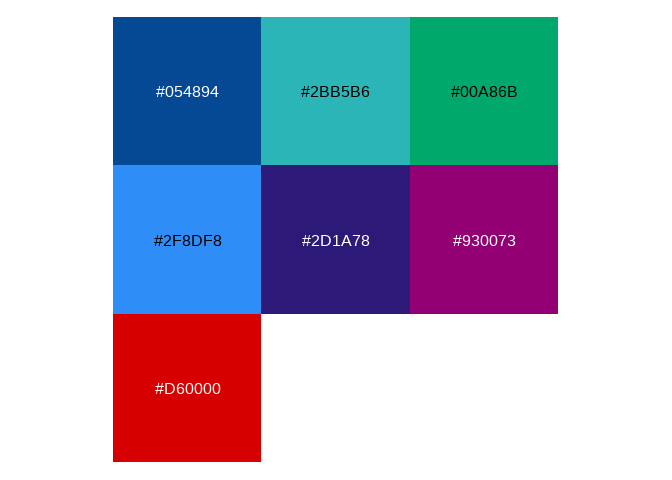
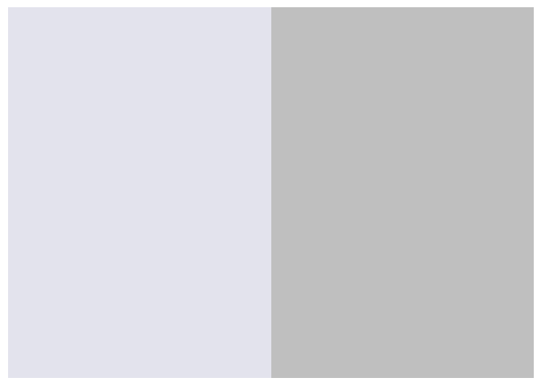
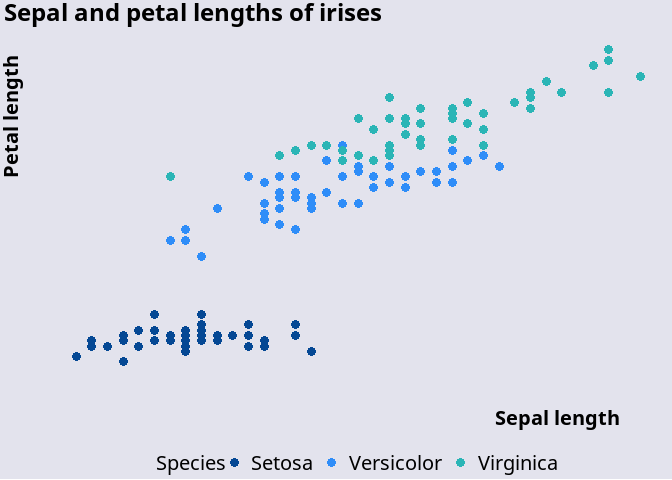

<!-- README.md is generated from README.Rmd. Please edit that file -->

# vagotheme

<!-- badges: start -->
<!-- badges: end -->

The main purpose of vagotheme is to enable R users in Australian public
policy to use the colours and styles defined in the Victoria Auditor
General’s Office’s style guide to create compliant visualisations in
ggplot.

vagotheme was created with the **palettes** package, which provides a
comprehensive library for colour vectors and colour palettes using a new
family of colour classes (`palettes_colour`, and `palettes_palette`)
that always print as hex codes with colour previews. Colour palette
packages created with palettes have access to the following
capabilities, all without requiring you to write any code: formatting,
casting and coercion, extraction and updating of components, plotting,
colour mixing arithmetic, and colour interpolation.

See the following vignettes to learn how to use palletes with other
packages: - [Using palettes with
ggplot2](https://mccarthy-m-g.github.io/palettes/articles/ggplot2.html) -
[Using palettes with
gt](https://mccarthy-m-g.github.io/palettes/articles/gt.html) - [Using
palettes with
biscale](https://mccarthy-m-g.github.io/palettes/articles/biscale.html) -
[Compatibility with other colour
packages](https://mccarthy-m-g.github.io/palettes/articles/compatibility.html)

## Installation

You can install the development version of vagotheme from
[GitHub](https://github.com/) with:

``` r
# install.packages("devtools")
devtools::install_github("zerogetsamgow/vagotheme")
```

## Included Colours

### Base colours

vagotheme’s base colour palette `vago_colours$base` comprises 7 colours.

    #> Loading required package: palettes



## Theme colours

vago’s theme colours `vago_colours$theme` reorders the colours to match
the order in the Windows theme.


## Chart

vago’s chart colours `vago_colours$chart`is a palette of four colours
that is the primary palette for charts .


## Lilac

An additional non palette colour `vago.lilac` is included to use as a
background colour.



## Installation

You can install the development version of vagotheme from
[GitHub](https://github.com/) with:

``` r
# install.packages("devtools")
devtools::install_github("zerogetsamgow/vagotheme")
```

## Usage

{vagotheme} is designed to produce {gglot2} that comply with the vago
style guide simply. For example.

``` r

## basic example code
ggplot2::ggplot(data=iris,aes(x=Sepal.Length, y = Petal.Length,colour=Species)) +
  geom_point(size = 3) +
  scale_colour_manual(values=(vago_colours$chart),labels=stringr::str_to_title) +
  scale_x_continuous(name="Sepal length")+
  scale_y_continuous(name="Petal length")+
  theme_vago_white()
```


{vagotheme} exports two themes - `theme_vago_white()`(seen above) and
`theme_vago_lilac()` to enable plots to be produced for any VAGO
publication.

``` r
## basic example of a green plot
ggplot(data=iris,aes(x=Sepal.Length, y = Petal.Length,colour=Species)) +
  geom_point(size=3) +
  scale_colour_manual(values=vago_colours$theme,labels=stringr::str_to_title) +
  scale_x_continuous(name="Sepal length")+
  scale_y_continuous(name="Petal length")+
  labs(title="Sepal and petal lengths of irises")+
  theme_vago_lilac()
```



As well as utilising vago coloutes these themes are rendered using the
`Segoe UI` font.

## Maps

{vagotheme} exports a theme - `theme_vago_map()` to be used when
plotting maps. This theme can be produced with white or lilax
backgrounds. White is the default.

    #> Linking to GEOS 3.11.2, GDAL 3.7.2, PROJ 9.3.0; sf_use_s2() is
    #> TRUE

``` r

## basic example of a map with grey background
ggplot(
  data = 
    strayr::read_absmap(
      name="state2021",
      remove_year_suffix = TRUE
      ) |> 
    filter(state_name %in% strayr::state_name_au) |> 
    mutate(state_name = 
             factor(
               state_name, 
               levels=strayr::state_name_au)
           ),
  aes(fill=state_name, x=cent_long, y =cent_lat, label = str_wrap(state_name,10))) +
  geom_sf() +
  geom_text(colour = "black", lineheight=.5)+
  scale_fill_manual(guide='none',values=colorspace::lighten(strayr::palette_state_name_2016,.7)) +
  labs(title="Australia's States and Territories")+
  theme_vago_map(base_colour = "white", base_size = 10)
```


``` r

## basic example of a map with grey background
ggplot(
  data = 
    strayr::read_absmap(
      name="state2021",
      remove_year_suffix = TRUE
      ) |> 
    filter(state_name %in% strayr::state_name_au) |> 
    mutate(state_name = 
             factor(
               state_name, 
               levels=strayr::state_name_au)
           ),
  aes(fill=state_name, x=cent_long, y =cent_lat, label = str_wrap(state_name,10))) +
  geom_sf() +
  geom_text(colour ="black", lineheight=.5)+
  scale_fill_manual(guide='none',values=colorspace::lighten(strayr::palette_state_name_2016,.2)) +
  labs(title="Australia's States and Territories")+
  theme_vago_map(base_colour = "lilac", base_size = 10)
#> Reading state2021 file found in C:\Users\SAMUEL~1\AppData\Local\Temp\RtmpSyBvW0
```


## Documentation

See also documentation for the palettes package at
[`https://mccarthy-m-g.github.io/palettes/`](https://mccarthy-m-g.github.io/palettes/reference/index.html)
or in the installed package: `help(package = "palettes")`.
