<!-- README.md is generated from README.Rmd. Please edit that file -->

# vagotheme

<!-- badges: start -->
<!-- badges: end -->

The main purpose of vagotheme is to enable R users in Australian public
policy to use the colours and styles defined in the Victoria Auditor
General’s Office’s style guide to create compliant visualisations in
ggplot.

vagotheme was created with the **palettes** package, which provides a
comprehensive library for colour vectors and colour palettes using a new
family of colour classes (`palettes_colour`, and `palettes_palette`)
that always print as hex codes with colour previews. Colour palette
packages created with palettes have access to the following
capabilities, all without requiring you to write any code: formatting,
casting and coercion, extraction and updating of components, plotting,
colour mixing arithmetic, and colour interpolation.

See the following vignettes to learn how to use palletes with other
packages: - [Using palettes with
ggplot2](https://mccarthy-m-g.github.io/palettes/articles/ggplot2.html) -
[Using palettes with
gt](https://mccarthy-m-g.github.io/palettes/articles/gt.html) - [Using
palettes with
biscale](https://mccarthy-m-g.github.io/palettes/articles/biscale.html) -
[Compatibility with other colour
packages](https://mccarthy-m-g.github.io/palettes/articles/compatibility.html)

## Installation

You can install the development version of vagotheme from
[GitHub](https://github.com/) with:

``` r
# install.packages("devtools")
devtools::install_github("zerogetsamgow/vagotheme")
```

## Included Colours

### Base colours

vagotheme’s base colour palette `vago_colours$base` comprises 7 colours.

    #> Loading required package: palettes


## Theme colours

vago’s theme colours `vago_colours$theme` reorders the colours to match
the order in the Windows theme.


## Chart

vago’s chart colours `vago_colours$chart`is a palette of four colours
that is the primary palette for charts .


## Other

Additional non palette colours `vago.lilac` and `vago.grey` are included
to use as background colours.


## Installation

You can install the development version of vagotheme from
[GitHub](https://github.com/) with:

``` r
# install.packages("devtools")
devtools::install_github("zerogetsamgow/vagotheme")
```

## Usage

{vagotheme} is designed to produce {gglot2} that comply with the vago
style guide simply. For example.

``` r

## basic example code
ggplot2::ggplot(data=iris,aes(x=Sepal.Length, y = Petal.Length,colour=Species)) +
  geom_point(size = 3) +
  scale_colour_manual(values=(vago_colours$chart),labels=stringr::str_to_title) +
  scale_x_continuous(name="Sepal length")+
  scale_y_continuous(name="Petal length")+
  theme_vago_white()
```

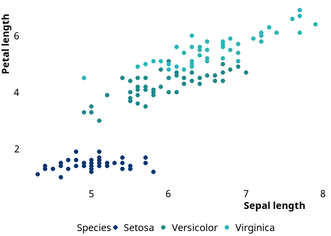

{vagotheme} exports two themes - `theme_vago_white()`(seen above) and
`theme_vago_lilac()` to enable plots to be produced for any VAGO
publication.

``` r
## example plot
ggplot(data=iris,aes(x=Sepal.Length, y = Petal.Length,colour=Species)) +
  geom_point(size=3) +
  scale_colour_manual(values=vago_colours$theme,labels=stringr::str_to_title) +
  scale_x_continuous(name="Sepal length")+
  scale_y_continuous(name="Petal length")+
  labs(title="Sepal and petal lengths of irises")+
  theme_vago_lilac()
```


As well as utilising vago colour these themes are rendered using the
`Segoe UI` font.

## VAGO Charts

### Column charts

Auditors use column charts most often because they are useful for
displaying and comparing discrete data sets, which is what we encounter
most. The order of the bars depends on the categories they depict. •
When there is a natural sequence we typically order the column left to
right (for example, a series of dates may be ordered earliest to most
recent). • If the dataset is not contiuous (eg. categorical or nominal
comparisons), we advise to use horizontal bar charts instead. • Consider
removing axis titles if they are self-explanatory, or fully explained in
the heading.

``` r
# Create tibble of data for examples
car_accidents = 
  tibble(
    year = c(2020,2021,2022,2023,2024),
    accidents = c(10,   5,  45, 10, 16)
  )

## basic example of a column plot
ggplot(data=car_accidents,aes(x=year, y = accidents)) +
  geom_col(fill = vago.blue) +
  geom_text(aes(label = accidents), size = 5, nudge_y = 1)+
  scale_x_continuous(name = NULL, breaks = 2020:2024)+
  scale_y_continuous(name = NULL, labels = NULL,  expand = c(0,0,.1,.1))+
  labs(title="Simple column charts",
       subtitle ="One-dimensional column chart: one colour, single axis, y-axis can be replaced by data label")+
  theme_vago_white()
```

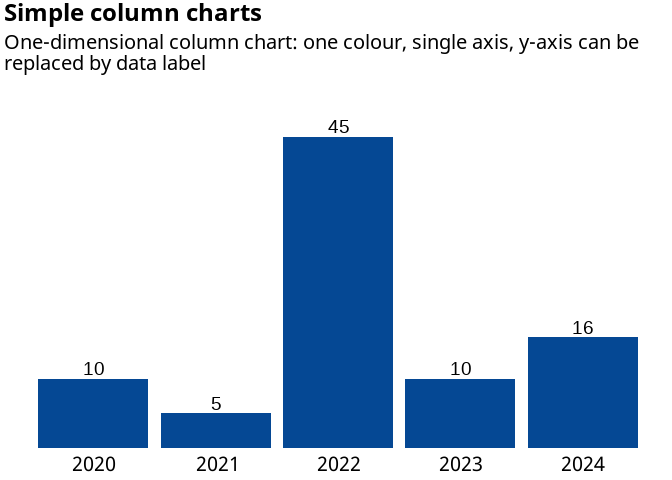

``` r
# Create tibble of data for examples
car_accidents = 
  tibble(
    month = rep(c("Jan","Feb","Mar","Apr","May"),4),
    freeway = c(rep("M1",5),rep("M2",5),rep("M3",5),rep("M4",5)),
    accidents = c(10, 5, 45, 10,    16, 
                  20, 10, 40, 12, 10, 
                  30, 15, 25, 14, 18, 
                  25, 20, 15, 18, 10)
  ) |> 
  mutate(month = factor(month, levels = month.abb),
         freeny = factor(freeway))

## example of multi colour column plot
ggplot(data=car_accidents,aes(x=month, y = accidents, fill = freeway)) +
  geom_col(position = position_dodge2()) +
  scale_x_discrete(name = NULL)+
  scale_y_continuous(name = NULL, expand = c(0,0))+
  scale_fill_manual(name = NULL, values = vago_colours$chart)+
  labs(title="Two-dimensional histogram: full colour",
       subtitle ="If you have more than 4 categories, please consider using different method to present.")+
  theme_vago_white()
```

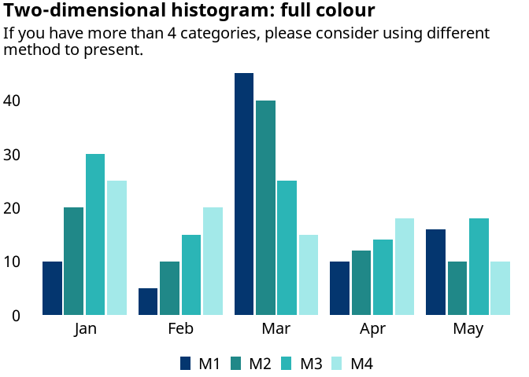

``` r
## example of single colour column plot
ggplot(
  data=car_accidents,
  aes(x=month, y = accidents, fill = freeway)) +
  geom_col(position = position_dodge2()) +
  scale_x_discrete(name = NULL)+
  scale_y_continuous(name = NULL, expand = c(0,0), limits = c(0,51))+
  scale_fill_manual(name = NULL, values = c(rep(vago.grey,3), vago.blue))+
  labs(title="Two-dimensional histogram: single series highlight",
       subtitle ="If you want to highlight one category and de-emphasise the remaining ones")+
  theme_vago_white()
```

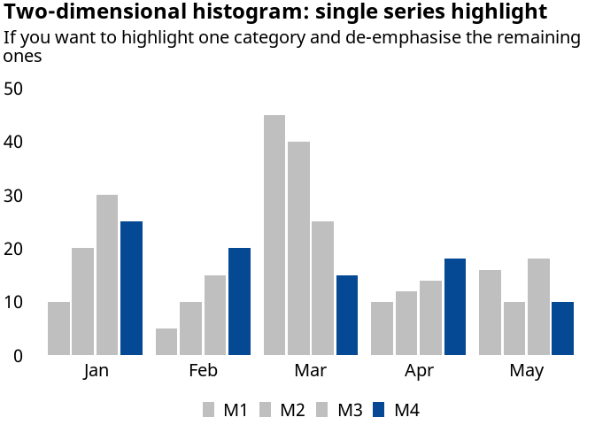

``` r
## example of multi colour stacked column plot
ggplot(
  data = car_accidents, 
  aes(
    x = month, 
    y = accidents, 
    fill = fct_rev(freeway), 
    label = accidents), 
    colour = fct_rev(freeway)) +
  geom_col(position = position_stack()) +
  geom_text(aes(colour= fct_rev(freeway)), position = position_stack(vjust = .5))+
  scale_x_discrete(name = NULL)+
  guides(fill = guide_legend(reverse = TRUE)) +
  scale_y_continuous(name = NULL, expand = c(0,0), limits = c(0,131))+
  scale_fill_manual(name = NULL, values = rev(vago_colours$chart))+
  scale_colour_manual(guide = "none", name = NULL, values = c("black","black","black","white"))+
  labs(title="Stacked column chart: full colour",
       subtitle ="Effective for illustrating how individual parts contribute to a whole.")+
  theme_vago_white()
```

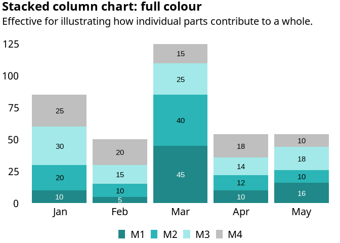

``` r
## example of single colour column plot
ggplot(data=car_accidents, 
       aes(x=month, 
           y = accidents, 
           fill = fct_rev(freeway), 
           label = accidents), 
           colour = fct_rev(freeway)) +
  geom_col(position = position_stack(), colour = "white") +
  geom_text(aes(colour= fct_rev(freeway)), position = position_stack(vjust = .5))+
  scale_x_discrete(name = NULL)+
  guides(fill = guide_legend(reverse = TRUE)) +
  scale_y_continuous(name = NULL, expand = c(0,0),limits = c(0,131))+
  scale_fill_manual(name = NULL, values = c(rep(vago.grey,3), vago.blue))+
  scale_colour_manual(guide = "none", name = NULL, values = c("black","black","black","white"))+
  labs(title="Stacked column chart: 2 colours, single series highlight",
       subtitle ="If you want to highlight one category and de-emphasise the remaining ones.")+
  theme_vago_white()
```

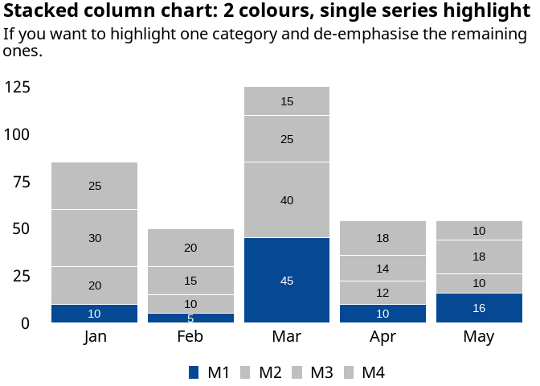

``` r
# Add shares to data
car_accidents =
  car_accidents |> 
  group_by(month) |> 
  mutate(share = accidents/sum(accidents))

## example of single colour column plot
ggplot(data=car_accidents,aes(x=month, y = share, fill = fct_rev(freeway), label = scales::percent(share, accuracy = 1))) +
  geom_col(position = position_stack()) +
  geom_text(aes(colour= fct_rev(freeway)), position = position_stack(vjust = .5))+
  guides(fill = guide_legend(reverse = TRUE)) +
  scale_x_discrete(name = NULL)+
  scale_y_continuous(name = NULL, expand = c(0,0), label = scales::label_percent(), limits = c(0,1.01))+
  scale_fill_manual(name = NULL, values = rev(vago_colours$chart))+
  scale_colour_manual(guide = "none", name = NULL, values = c("black","black","black","white"))+
  labs(title="100% Stacked column chart: full colour",
       subtitle ="Effective to show relative contributions.")+
  theme_vago_white()
```


``` r
# Create data tibble to add forecaast variable
forecast = tibble(
  month = factor(c("Jan","Feb","Mar","Apr","May"), levels = month.abb),
  forecast = c("Actual","Actual","Actual","Forecast","Forecast"))

# Add to car_accidents using join
car_accidents =
  car_accidents |>
  left_join(forecast)
#> Joining with `by = join_by(month)`

## example of single colour column plot
ggplot(
  data=car_accidents,
  aes(
    x = month, 
    y = share, 
    alpha = forecast,
    fill = fct_rev(freeway),
    label = scales::percent(share, accuracy = 1))) +
  geom_col(position = position_stack()) +
  geom_text(
    aes(colour= fct_rev(freeway)),
    position = position_stack(vjust = .5))+
  guides(fill = guide_legend(reverse = TRUE)) +
  scale_x_discrete(name = NULL)+
  scale_alpha_manual(values = c(1,.6), guide = "none")+
  scale_y_continuous(name = NULL, expand = c(0,0), label = scales::label_percent())+
  scale_fill_manual(name = NULL, values = rev(vago_colours$chart))+
  scale_colour_manual(guide = "none", name = NULL, values = c("black","black","black","white"))+
  labs(title="100% Stacked column chart: full colour with forecast",
       subtitle ="You may consider using a shading pattern for forecast data.")+
  theme_vago_white()
```


### Bar charts

Auditors use bar charts because they are a useful alternative to column
charts, especially where category labels are lengthy, there’s no natural
date sequence or there are only a few bars in the chart.

The order of the bars depends on the categories they depict: • when
there is a natural sequence then typically column charts are preferred
(for example, time series from left to right). • where there is no
natural sequence, it may be appropriate to: - order categories
alphabetically, especially if you wish to avoid perceptions of bias -
order from highest to lowest (or lowest to highest), particularly if the
issue is about demonstrating relativity between better practices and
worst practices.

``` r
# Create data tibble
airport_flights = 
  tibble(
    city = c("London",  "Milan",    "Paris",    "Prague",   "Lisbon"),
    flights = c(45,16,  10, 10, 5)
  )

## example plot
ggplot(
  data = airport_flights, 
  aes(
    x = reorder(city, flights), 
    y = flights)) +
  geom_col(fill = vago.blue) +
  # Convert from columb to horizontal bar using coord_flip
  coord_flip()+
  geom_text(aes(label = flights), size = 5, nudge_y = 1)+
  scale_x_discrete(name = NULL)+
  scale_y_continuous(name = NULL, labels = NULL,  expand = c(0,0,.1,.1))+
  labs(title="Bar chart: one colour")+
  theme_vago_white()
```


``` r

mode_shares = 
  tibble(
    mode = 
      rep(
        c("Walk","Tram","Train","Bike","Car"),
        4) |> 
      factor(levels = c("Walk","Tram","Train","Bike","Car")),
    council = 
      c(rep("Council A",5),
        rep("Council B",5),
        rep("Council C",5),
        rep("Council D",5)),
    trips = 
      c(45, 16, 10, 10, 5, 
        40, 10, 12, 20, 10, 
        25, 18, 14, 30, 15, 
        15, 19, 18, 25, 20)
  )
# Create chart
ggplot(
  data = mode_shares, 
  aes(
    x = fct_rev(mode), 
    y = trips,
    fill = factor(council) |> fct_rev(),
    )
  )+
  geom_col() +
  geom_text(
    aes(label = trips,colour= factor(council) |> fct_rev()), 
    position = position_stack(vjust =.5))+
  # Convert from columb to horizontal bar using coord_flip
  coord_flip()+
  guides(fill = guide_legend(reverse = TRUE))+
  scale_x_discrete(name = NULL,  expand = c(0,0,.1,.1))+
  scale_y_continuous(
    name = NULL, expand = c(0,0,.1,.1), breaks = seq(0,140, by = 20))+
  scale_fill_manual(
    name = NULL, values = rev(vago_colours$chart))+
  scale_colour_manual(
    guide = "none", name = NULL, 
    values = c("black","black","white","white"))+
  labs(
    title="Stacked bar chart: full colour",
    subtitle = "Use to show how each category contributes to the total and what percentage each represents.")+
  theme_vago_white()
```

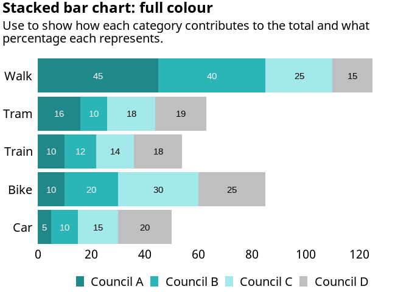

### Line charts

Line charts display information as a series of data points connected by
straight line segments. The measurement points are typically ordered by
their x-axis value.

Line charts are best at showing how particular data changes at equal
intervals of time. Use them to visualise a trend in data

Line charts emphasise time flow and rate of change, rather than the
amount of change.

Key points: • Use markers to show your actual data points to distinguish
the series from a continuous distribution. However, if there are many
categories or the values are approximate, use a line chart without
markers. • Use lines between markers to show trends. Use dashed lines if
you want the focus to be on the markers. • *Do not* use a line chart if
you are displaying categories on the X axis. Use a bar chart instead. •
*Do not* use more than 2 colours in one chart. If the data series is a
‘nice to have’, push them to the background by using a dark grey colour.

``` r
# Line chart data 
line_data = 
  tibble(
    year = 
      rep(2020:2024,5),
    council = 
      c(rep("Council A",5),
        rep("Council B",5),
        rep("Council C",5),
        rep("Council D",5),
        rep("Target",5)),
    trips = 
      c(300,    150,    220,    260,    340,
        300,    190,    220,    400,    275,
        203,    157,    169,    223,    400,
        204,    187,    290,    325,  150,
        300,    300,    300,    300,    300)
  )

## example plot
ggplot(
  data = line_data |> filter(str_detect(council, "A")), 
  aes(
    x = year, 
    y = trips,
    fill = council,
    colour = council,
    )
  )+
  geom_point()+
  geom_line() +
  scale_x_continuous(name = NULL, breaks = 2020:2024)+
  scale_y_continuous(name = NULL, expand = c(0,0), limits = c(0,410), breaks = seq(0,400, by = 100))+
  scale_fill_manual(name = NULL, guide = "none", values = (vago_colours$chart))+
  scale_colour_manual(name = NULL,guide = "none",  values = (vago_colours$chart))+
  labs(title="Single line",
       subtitle = "One-dimensional line: one colour, single axis")+
  theme_vago_white()
```


``` r
## example plot
ggplot(
  data = line_data |> filter(str_detect(council, "A|B")), 
  aes(
    x = year, 
    y = trips,
    fill = council,
    colour = council,
    )
  )+
  geom_point()+
  geom_line() +
  geom_text(
    data =  line_data |> filter(str_detect(council, "A|B"), year == max(year)),
    aes(label = council), nudge_y = 10) +
  scale_x_continuous(name = NULL, breaks = 2020:2024.3)+
  scale_y_continuous(name = NULL, expand = c(0,0), limits = c(0,510), breaks = seq(0,500, by = 100))+
  scale_fill_manual(name = NULL, guide = "none", values = (vago_colours$chart))+
  scale_colour_manual(name = NULL,guide = "none",  values = (vago_colours$chart))+
  labs(title="Two lines",
       subtitle = "Two-dimensional line: 2 colours, single axis")+
  theme_vago_white()
```

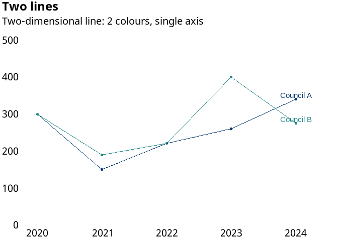

``` r
## example plot
ggplot(
  data = line_data |> filter(str_detect(council, "A")), 
  aes(
    x = year, 
    y = trips,
    fill = council,
    colour = council,
    )
  )+
  geom_line(
    data = line_data |> filter(str_detect(council, "Target")), 
    linetype = 2, 
    colour = vago.grey
    ) +
  geom_point()+
  geom_line() +
  geom_text(
    data =  line_data |> 
      filter(str_detect(council, "Target"), 
             year == max(year)),
    aes(label = council),
    colour = "black",
    size = 5,
    hjust = 0, 
    nudge_x = .05) +
  scale_x_continuous(name = NULL, breaks = 2020:2024, limits = c(2020,2024.3))+
  scale_y_continuous(
    name = NULL, expand = c(0,0), 
    limits = c(0,510), breaks = seq(0,500, by = 100))+
  scale_fill_manual(name = NULL, guide = "none", values = (vago_colours$chart))+
  scale_colour_manual(name = NULL,guide = "none",  values = (vago_colours$chart))+
  labs(title="Two lines",
       subtitle = "Two-dimensional line: 2 colours, single axis")+
  theme_vago_white()
```

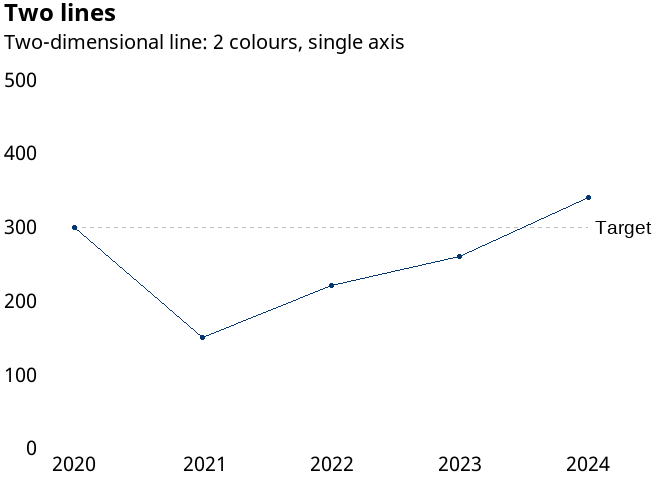

``` r
## example plot
ggplot(
  data = line_data |> filter(str_detect(council, "A")), 
  aes(
    x = year, 
    y = trips,
    fill = council,
    colour = council,
    )
  )+
  geom_line(
    data = line_data |> filter(!str_detect(council, "A|Target")), 
    colour = vago.grey
  ) +
  geom_line() +
  geom_text(
    data =  line_data |> filter(str_detect(council, "A"), year == max(year)),
    aes(label = council), nudge_y = 10) +
  scale_x_continuous(name = NULL, breaks = 2020:2024)+
  scale_y_continuous(name = NULL, expand = c(0,0), limits = c(0,510), breaks = seq(0,500, by = 100))+
  scale_fill_manual(name = NULL, guide = "none", values = (vago_colours$chart))+
  scale_colour_manual(name = NULL,guide = "none",  values = (vago_colours$chart))+
  labs(title="Multiple lines",
       subtitle = "One colour")+
  theme_vago_white()
```


``` r
## example plot
ggplot(
  data = line_data |> filter(str_detect(council, "A|D")), 
  aes(
    x = year, 
    y = trips,
    fill = council,
    colour = council,
    )
  )+
  geom_line(
    data = line_data |> filter(!str_detect(council, "A|D|Target")), 
    colour = vago.grey
  ) +
  geom_line() +
  ggrepel::geom_text_repel(
    data =  line_data |> filter(str_detect(council, "A|D"), year == max(year)),
    aes(label = council), direction = "y", force = 40, min.segment.length = 20) +
  scale_x_continuous(name = NULL, breaks = 2020:2024)+
  scale_y_continuous(name = NULL, expand = c(0,0), limits = c(0,510), breaks = seq(0,500, by = 100))+
  scale_fill_manual(name = NULL, guide = "none", values = (vago_colours$chart))+
  scale_colour_manual(name = NULL,guide = "none",  values = (vago_colours$chart))+
  labs(title="Multiple lines",
       subtitle = "Two colours")+
  theme_vago_white()
```

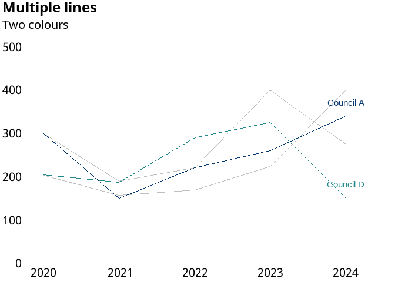

``` r
comparison_data =
  tibble(
    year = rep(c(2016:2024),2),
    type = c(rep("Expenditure",9),rep("Income",9)),
    value =
      c(42206844,   47883821,   60827924,   
        115072080, 138989959,   164836433,  
        191977494,  203121809,  231789110,
        23008170,   27059913,   32949213,   
        36212567,   40825086,   50466673,   
        60960692,   71814854,   100712099)
    )

## example plot
ggplot(
  data = comparison_data , 
  aes(
    x = year, 
    y = value/1e6,
    colour = type,
    )
  )+
  geom_line() +
  ggrepel::geom_text_repel(
    data =  comparison_data |> filter(year == max(year)),
    aes(label = type, colour = type), direction = "y", size = 5,
    force = 40, min.segment.length = 20) +
  scale_x_continuous(name = NULL, breaks = 2016:2024)+
  geom_segment(data = tibble(x = 2021.5, xend = 2021.5, y = 60, yend = 170, type = NA), 
               aes(x = x, y = y, xend = xend, yend=yend), colour = vago.grey, fill = NA)+
  annotate(geom = "text", size = 5, hjust = 0, label = "Difference = net cost", x = 2021.7, y = 115)+
  scale_y_continuous(
    name = "$ million", 
    expand = c(0,0), 
    limits = c(0,260), 
    breaks = seq(0,500, by = 50))+
  scale_fill_manual(name = NULL, guide = "none", values = (vago_colours$chart))+
  scale_colour_manual(name = NULL,guide = "none",  values = (vago_colours$chart))+
  labs(title="Two colours",
       subtitle = "Highlighting difference")+
  theme_vago_white()
#> Warning in geom_segment(data = tibble(x = 2021.5, xend = 2021.5,
#> y = 60, : Ignoring unknown parameters: `fill`
```

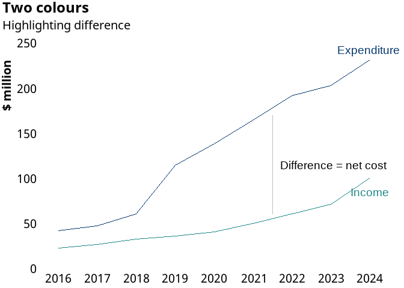

## Maps

{vagotheme} exports a theme - `theme_vago_map()` to be used when
plotting maps. This theme can be produced with white or lilax
backgrounds. White is the default.

``` r

## basic example of a map with white background
ggplot(
  data = 
    strayr::read_absmap(
      name="sa42021",
      remove_year_suffix = TRUE
      ) |> 
    filter(state_name == "Victoria"),
  aes(
    geometry = geometry, 
    fill=state_name)
  ) +
  geom_sf() +
  scale_fill_manual(guide='none',values=vago.blue) +
  theme_vago_map(base_colour = "white", base_size = 10)
```


``` r

## basic example of a map with lilac background
ggplot(
  data = 
    strayr::read_absmap(
      name="sa42021",
      remove_year_suffix = TRUE
      ) |> 
    filter(state_name == "Victoria"),
  aes(
    geometry = geometry, 
    fill=state_name)
  ) +
  geom_sf() +
  scale_fill_manual(guide='none',values=vago.blue) +
  theme_vago_map(base_colour = "lilac", base_size = 10)
#> Reading sa42021 file found in C:\Users\SAMUEL~1\AppData\Local\Temp\Rtmp4wWuww
```


## Documentation

See also documentation for the palettes package at
[`https://mccarthy-m-g.github.io/palettes/`](https://mccarthy-m-g.github.io/palettes/reference/index.html)
or in the installed package: `help(package = "palettes")`.
